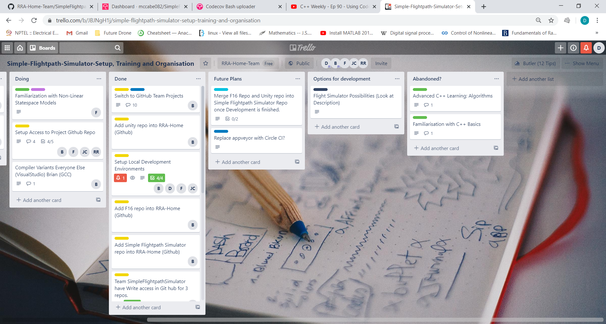
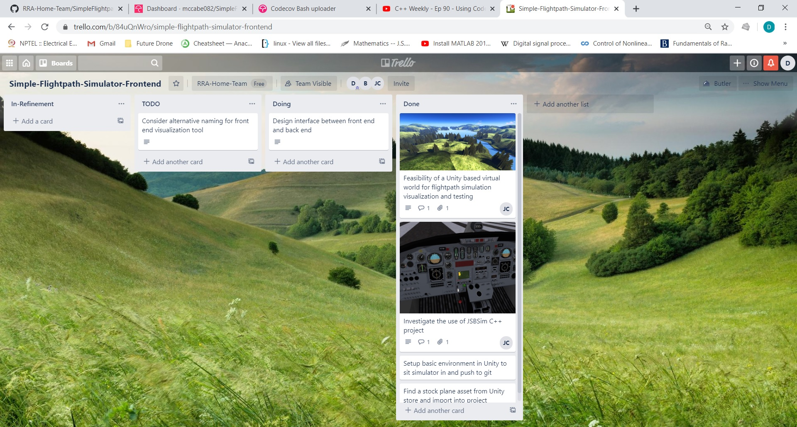

# Programme Structure

No hard plans - the project will evolve naturally but our current intentions for the next 3 weeks (20th April - 7th May) is to;
- build a lean and robust off-line development process
- build a scenario editor which simulated radar targets as a sequence of choreographed (scripted) maneouvers
- Simulate reasonably sophisticated

|**Lean & Robust Software Process** | 
|---|
| |
Has been the main focus of the programme so far
- Establishing ways of working remotely using home PCs
  - *Communication* using WhatsApp, [Discord](https://discord.gg/6zMa4Tp) and [WebEx](https://selex-es.webex.com/selex-es/j.php?MTID=m992415bfae7c0d8952ab784b2ff517f1)
  - *Colaborative development* through a [Github Organisation](https://github.com/RRA-Home-Team) and a [Trello Team](https://trello.com/simpleflightpathgeneratorteam/home)
- Utilising thirdparty automation tools an ultra lean development process
  - *No documented protocall/process* - carte blanche unless physically constrained
    - Disallow unreviewed commits through github
    - Prohibit failing unit tests through githooks
    - Writing [good C++ by default](https://www.youtube.com/watch?time_continue=21&v=hEx5DNLWGgA&feature=emb_logo) by using a C++ [Core Guidelines](https://isocpp.github.io/CppCoreGuidelines/CppCoreGuidelines) "checker"
  - *Feedback* - Peer review, Continuous Integration, Retrospectives, Code Coverage, Test Driven Development etc... Transparency->Introspection->Adaption

|**Basic Target Simulation**|
|---|
| |
Planning a system for chaining together a sequence of predefined manouvers;
- straight and level cruise
- climb/decent
- constant rate turn
- corkscrew...

|**Target Playback**| 
|---|
||
Developing a system for analysing generated target data intuitively;
- Unity Framework for visualising numerical output
- investigation into other respected C++ projects, specifically, [FlightGear](https://en.wikipedia.org/wiki/FlightGear) and [JSBSim](https://en.wikipedia.org/wiki/JSBSim)
 
|**Flight Simulator**|
|---|
||
(Stretch) Developing a data driven flight simulator in C++;
- Writing a reasonably sophisticated flight simulator which is controllable from Unity

